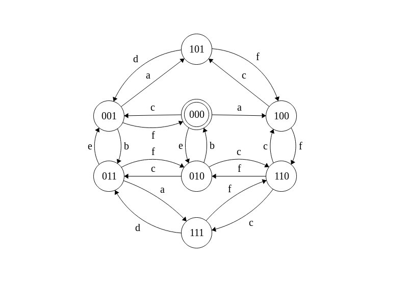

# Crazy river
The system described is a connected pools with a cleaner wich connects in feedback the flow.
 
Here a graphical representation

## Tanks
*Tanks automaton* presents 3 tanks wich can overflow indipendently. If the first tank overflow water, the excedeed water go on tank number 2, viceversa for tanks number 2. If tank number 2 goes in overflow the excedeed water is lost. There is a fourth tank wich takes a costant flow from each of 3 tanks and purify it. It must garantee a minimal level of water to purify water.

**Transition table:**

|   | S0 | S1 | S2 | S3 | S4 | S5 | S6 | S7 |
|---|----|----|----|----|----|----|----|----|
| a := z1>H1| S1 | -  | S4 | S5 | -  | -  | S7 | -  |
| b := z2>H2 | S2 | S4 | -  | S6 | -  | S7 | -  | -  |
| c := z3>H3 | S3 | S5 | S6 | -  | S7 | -  | -  | -  |
| d := $$ \beta_1 * a + \alpha_1 * z_1 < 0 $$ | -  | S0 | -  | -  | S2 | S3 | -  | S6 |
| e :=  $$ \beta_2 * a + \alpha_2 * z_2 < 0 $$ | -  | -  | S0 | -  | S1 | -  | S3 | S5 |
| f :=  $$ \beta_3 * a + \alpha_3 * z_3 < 0 $$ | -  | -  | -  | S0 | -  | S1 | S2 | S4 |

## Controller
The controller check if one of a water level of the 3 tank in overflow is lower or greater than $$ h_{min} $$ or $$ h_{max} $$ respectively.

## Valve
The valve has a variable (a) wich describes opening and closing states used by controller.