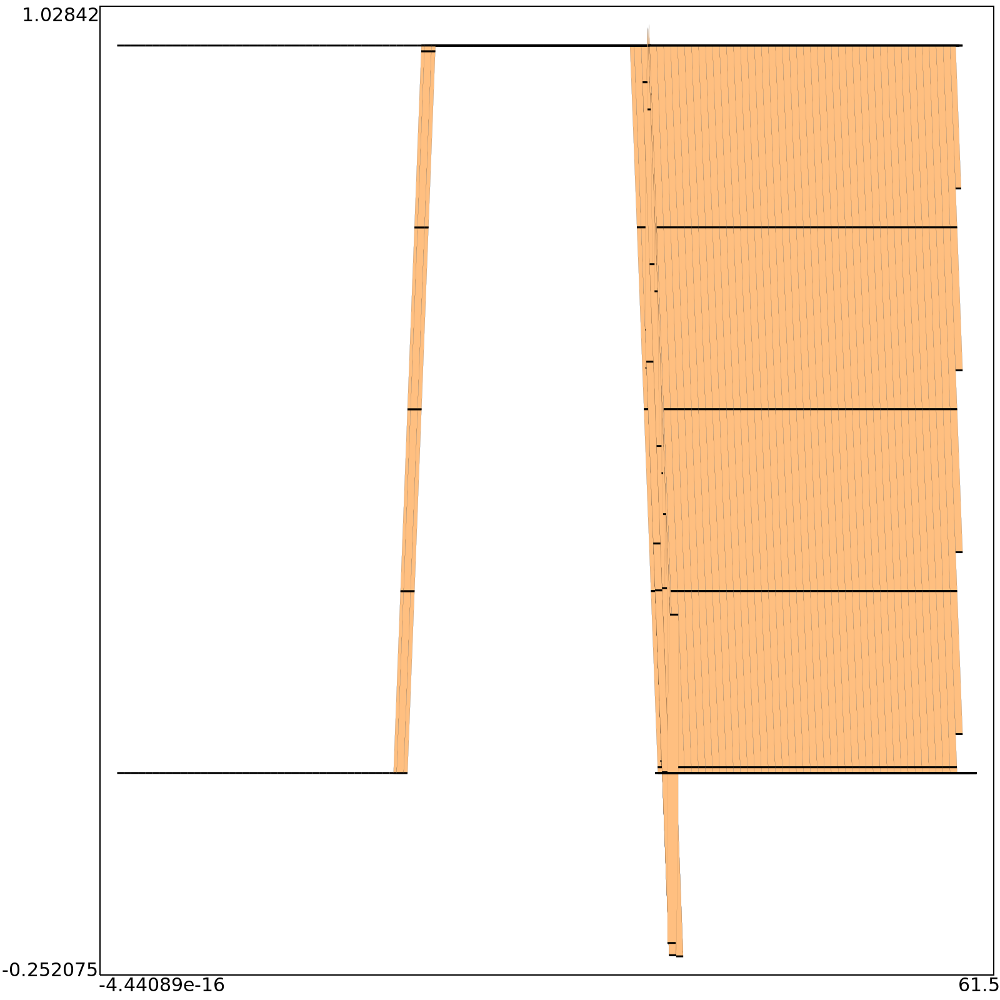
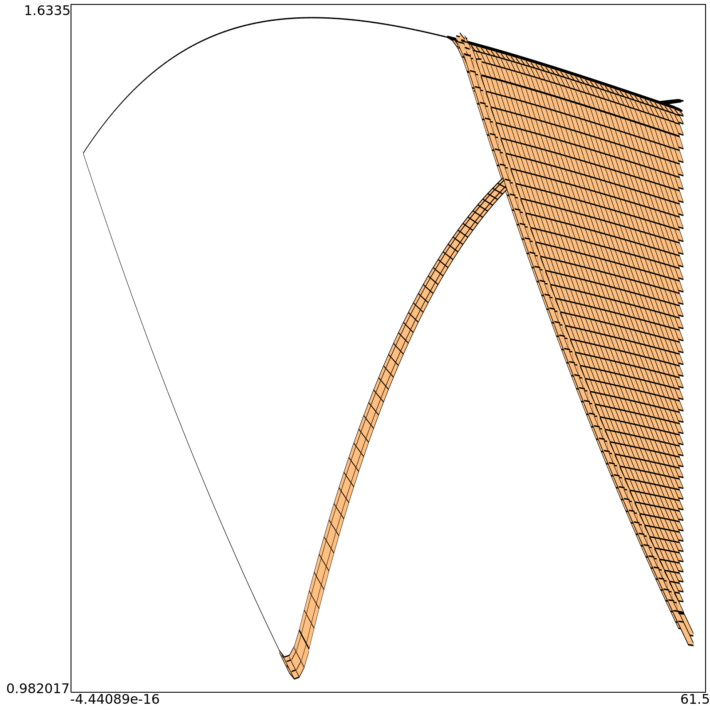
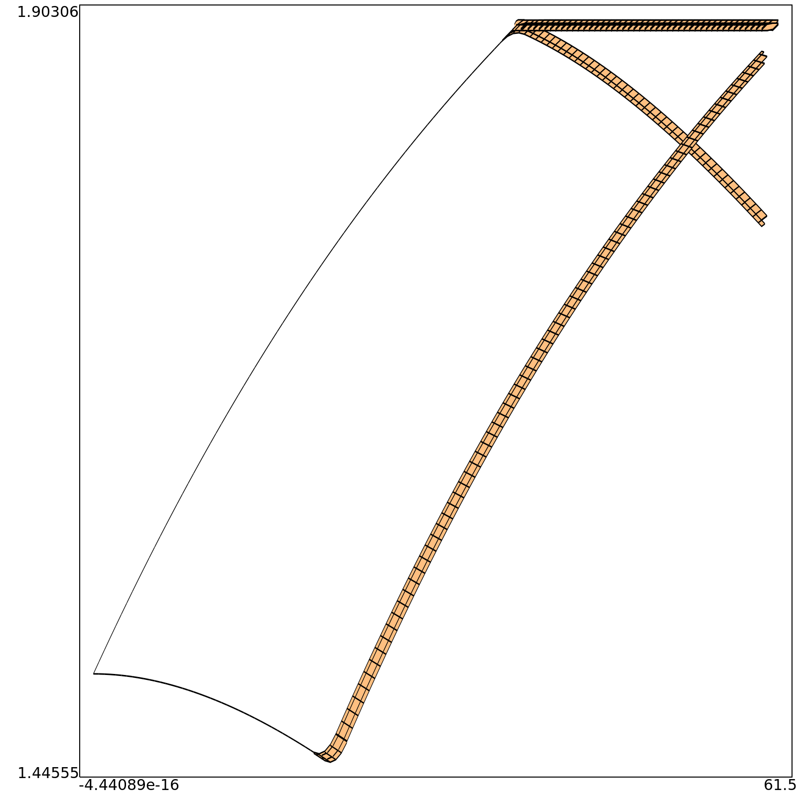
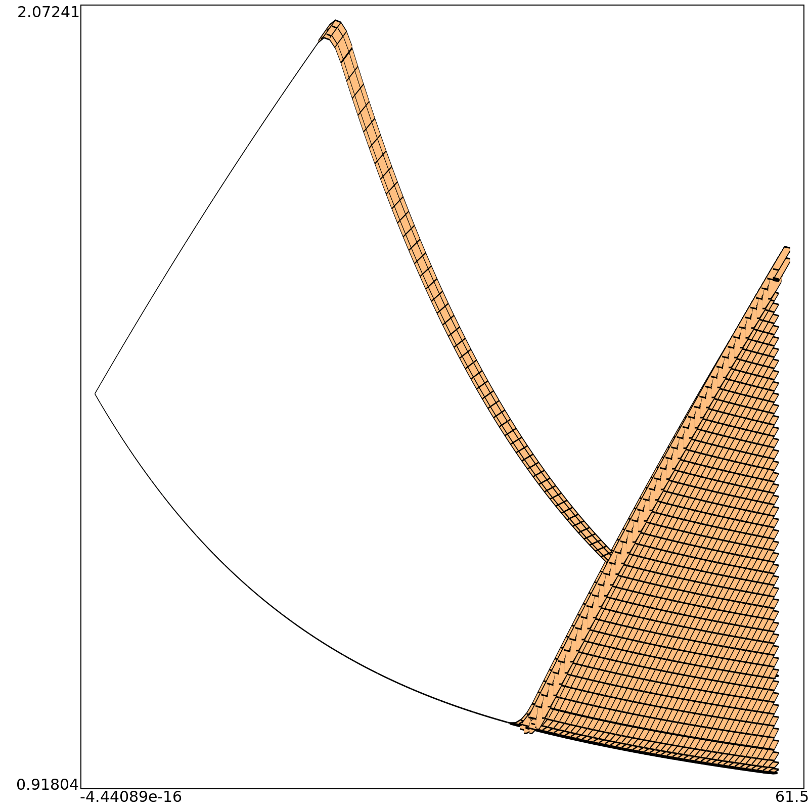

# Crazy river
The system described is a connected pools with a cleaner wich connects in feedback the flow.
 
Here a graphical representation

## Tanks
*Tanks automaton* presents 3 tanks wich can overflow indipendently. If the first tank overflow water, the excedeed water go on tank number 2, viceversa for tanks number 2. If tank number 2 goes in overflow the excedeed water is lost. There is a fourth tank wich takes a costant flow from each of 3 tanks and purify it. It must garantee a minimal level of water to purify water.

**State description**
$S_0$ := overflow nowhere
$S_1$ := overflow only on first tank
$S_2$ := overflow only on second tank
$S_3$ := overflow only on third tank
$S_4$ := overflow on first and second tank
$S_5$ := overflow on first and third tank
$S_6$ := overflow on second and third tank
$S_7$ := overflow on every tank

**Transition table:**

|   | S0 | S1 | S2 | S3 | S4 | S5 | S6 | S7 |
|---|----|----|----|----|----|----|----|----|
| a := $z_1>H_1$| S1 | -  | S4 | S5 | -  | -  | S7 | -  |
| b := $z_2>H_2$ | S2 | S4 | -  | S6 | -  | S7 | -  | -  |
| c := $z_3>H_3$ | S3 | S5 | S6 | -  | S7 | -  | -  | -  |
| d := $ \beta_1 * a + \alpha_1 * z_1 < 0 $ | -  | S0 | -  | -  | S2 | S3 | -  | S6 |
| e :=  $ \beta_2 * a + \alpha_2 * z_2 < 0 $ | -  | -  | S0 | -  | S1 | -  | S3 | S5 |
| f :=  $ \beta_3 * a + \alpha_3 * z_3 < 0 $ | -  | -  | -  | S0 | -  | S1 | S2 | S4 |

## Controller
To simplify the controller execution, only the first tank is under lower control (wich means if $ z_1 < h_{min} $ then open valve $ a $), and the third tank is under upper control (wich means if $ z3 > H3 $ the close valve $ a $). This is correct in this context because the assumption is that first tank has the bigger output flow, so the overflow can fill the others lack.
## Valve
The valve has a variable (a) wich describes opening and closing states used by controller.

# Semplified crazy river
To semplify the execution the third tank is deleted and a time calculation is added:

**State description**
$S_0$ := overflow nowhere
$S_1$ := overflow only on first tank
$S_2$ := overflow only on second tank
$S_4$ := overflow on first and second tank

**Transition table:**

|   | S0 | S1 | S2 | S4 | 
|---|----|----|----|----|
| a := $z_1>H_1$| S1 | -  | S4 | - |
| b := $z_2>H_2$ | S2 | S4 | -  | - |
| d := $ \beta_1 * a + \alpha_1 * z_1 < 0 $ | -  | S0 | - | S2 |
| e :=  $ \beta_2 * a + \alpha_2 * z_2 < 0 $ | -  | -  | S0 | S1 |

## Time analysis
Per la simulazione si è scelto di partire da due stati:
- S0,idle,falling (quindi nesssun overflow e valvole spente)
- S0,idle,rising (quindi nessun overflow e valvole accese)
Di seguito sono rappresentate entrambe le tracce nel range [0,60] secondi.
**a(time)**

**z1(time)**

**z2(time)**

**z4(time)**

The graphs certify what was hypothesized, the purifier opening the valve empties but at the same time fills the other valves and subsequently they re-establish the level of the purifier.