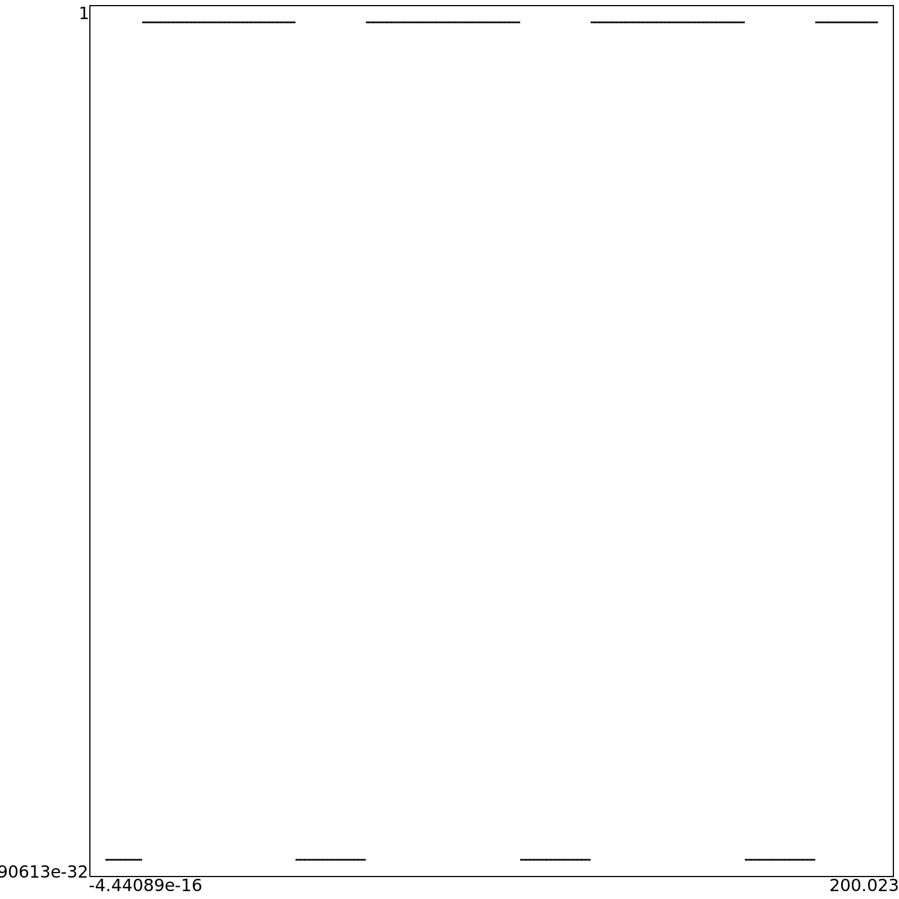
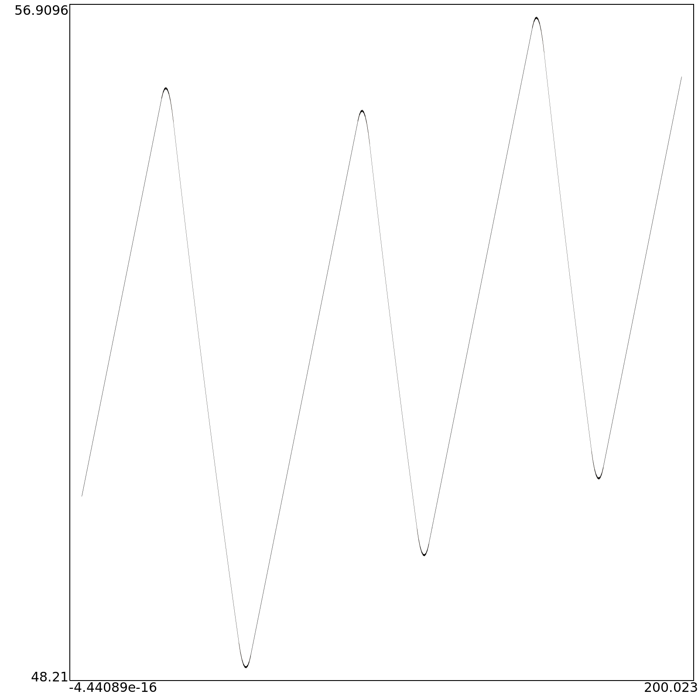
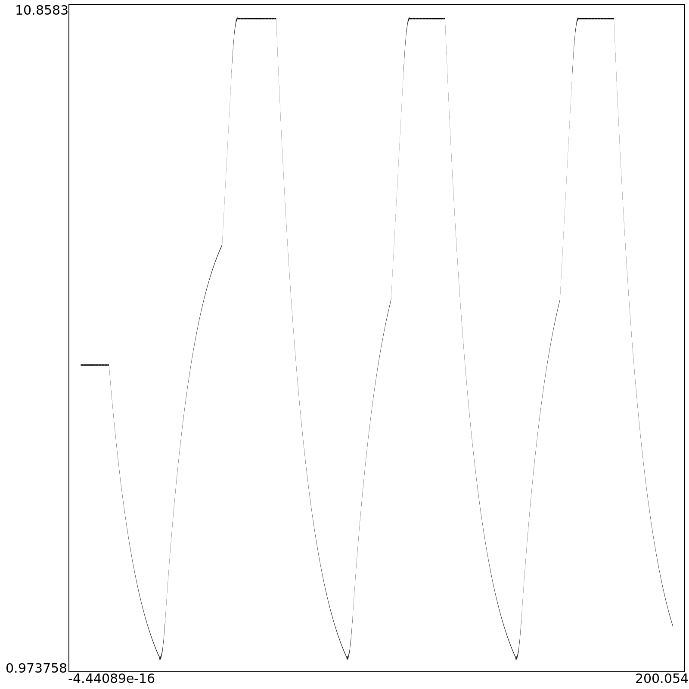
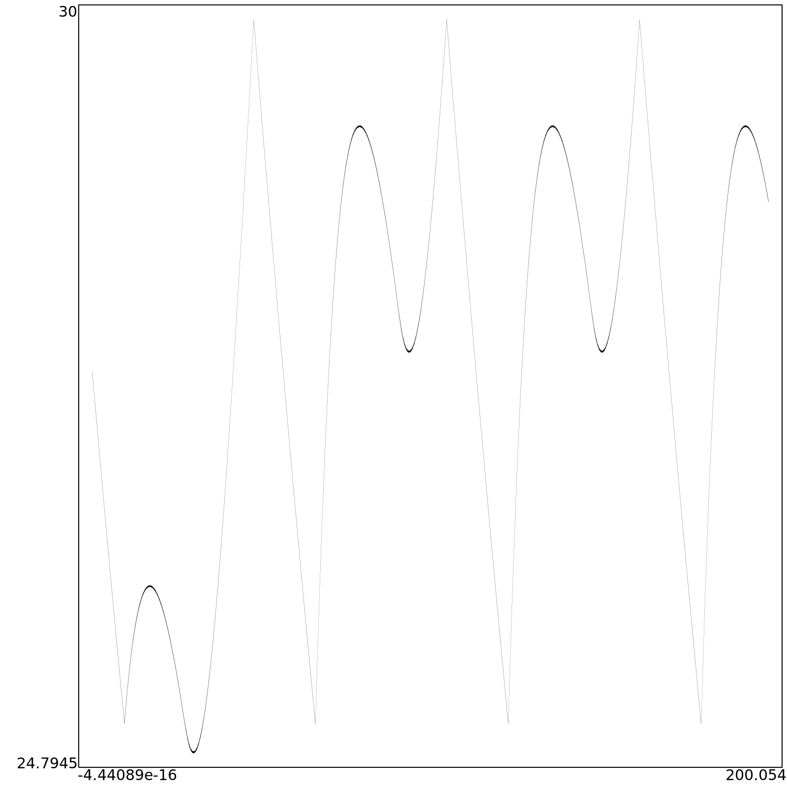

# Dam system to warm a pool
The system described is a big tank wich through a pump gives a flow to a mill that generates energy to warp a pool.
 
Here a graphical representation

## Tanks
*Tanks automaton* presents 5 variables:
- *l* the first water tank (as lake)
- *p* the energy tank (as power)
- *t* the temperature status (as temperature)
- *a* the pump valve aperture
- *b* the switch valve aperture for warming the pool

## Reachable set in function of time
**a(time)**

**b(time)**

**l(time)**

**p(time)**

**t(time)**
