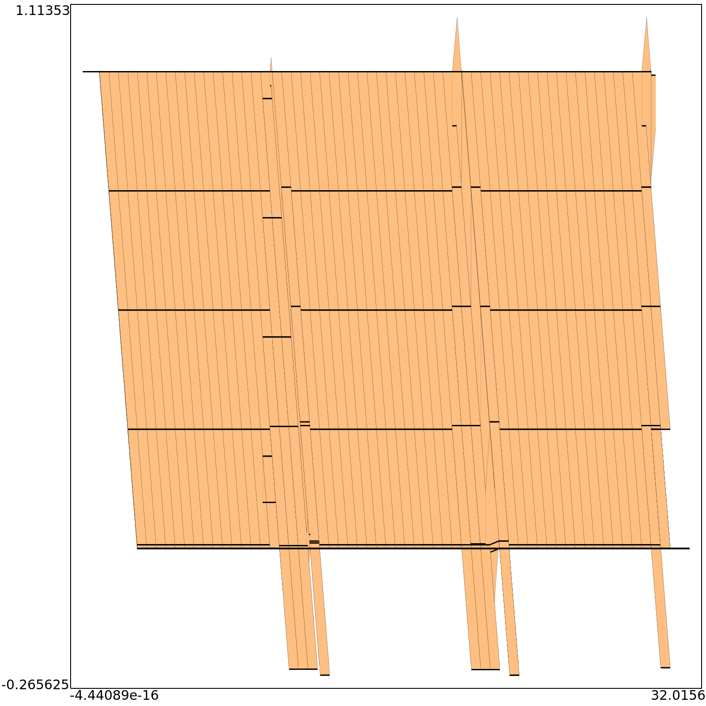
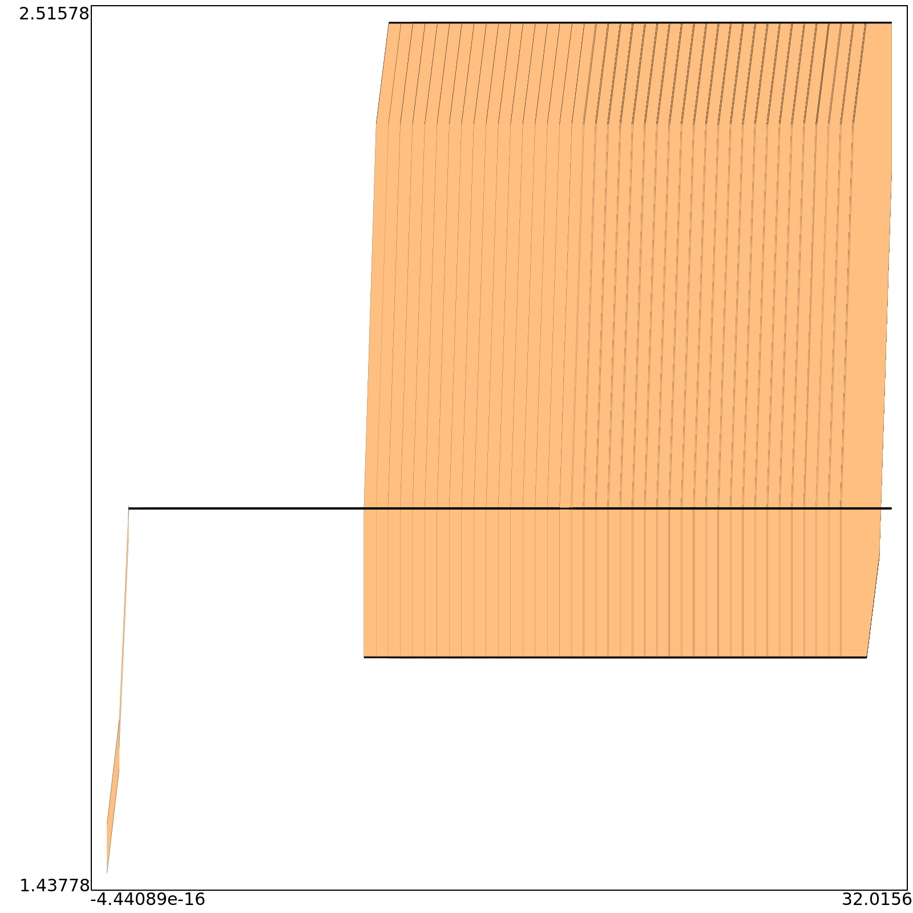
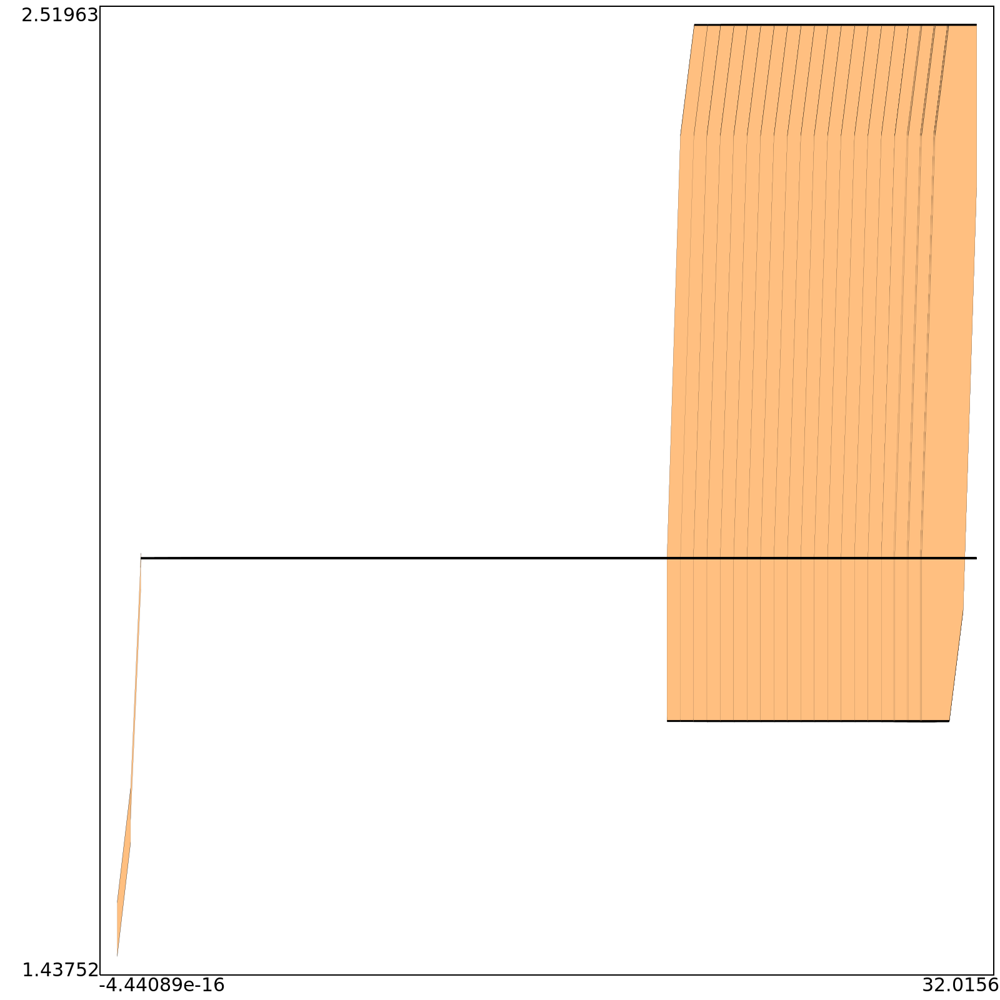
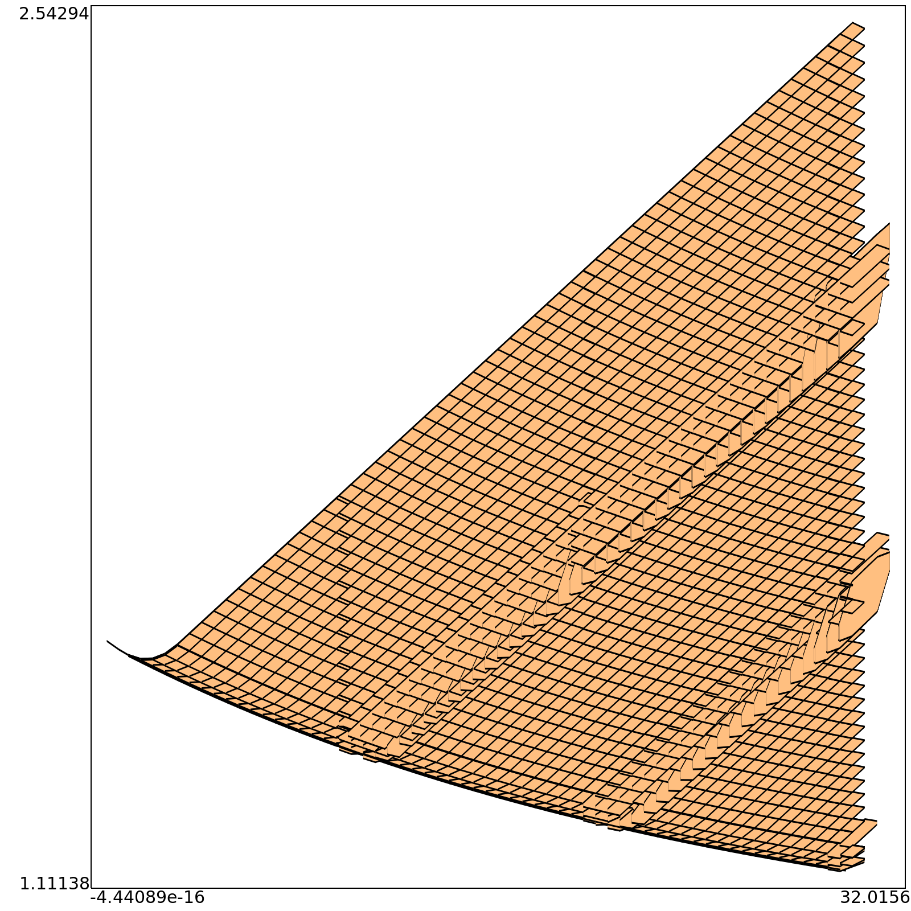
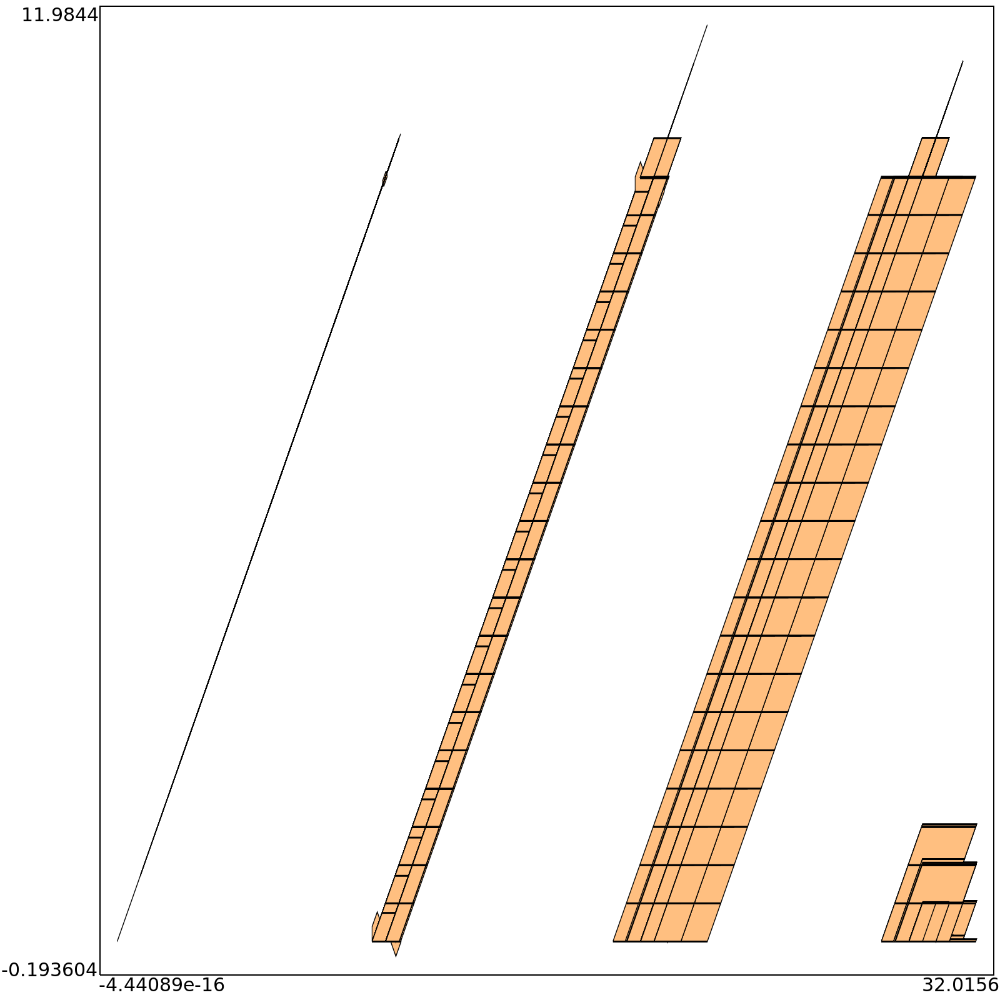

# Scottland issue
The system is created composing crazy river (easy version) with a stormy weather.
The stormy weather is described as a an automaton wich models a sawtooth or a sinusoidal function.
 
Here a graphical representation

## Tanks
*Tanks automaton* presents 2 tanks wich can overflow indipendently. If the first tank overflow water, the excedeed water go on tank number 2. If tank number 2 goes in overflow the excedeed water is lost. There is a third tank wich takes a costant flow from each of 2 tanks and purify it. It must garantee a minimal level of water to purify water.

**State description**
$S_0$ := overflow nowhere
$S_1$ := overflow only on first tank
$S_2$ := overflow only on second tank
$S_3$ := overflow only on third tank
$S_4$ := overflow on first and second tank
$S_5$ := overflow on first and third tank
$S_6$ := overflow on second and third tank
$S_7$ := overflow on every tank

**Transition table:**

|   | S0 | S1 | S2 | S3 | S4 | S5 | S6 | S7 |
|---|----|----|----|----|----|----|----|----|
| a := $z_1>H_1$| S1 | -  | S4 | S5 | -  | -  | S7 | -  |
| b := $z_2>H_2$ | S2 | S4 | -  | S6 | -  | S7 | -  | -  |
| c := $z_3>H_3$ | S3 | S5 | S6 | -  | S7 | -  | -  | -  |
| d := $ \beta_1 * a + \alpha_1 * z_1 < 0 $ | -  | S0 | -  | -  | S2 | S3 | -  | S6 |
| e :=  $ \beta_2 * a + \alpha_2 * z_2 < 0 $ | -  | -  | S0 | -  | S1 | -  | S3 | S5 |
| f :=  $ \beta_3 * a + \alpha_3 * z_3 < 0 $ | -  | -  | -  | S0 | -  | S1 | S2 | S4 |

## Controller
The controller check if one of a water level of the 3 tank in overflow is lower or greater than $ h_{min} $ or $ h_{max} $ respectively.

## Valve
The valve has a variable (a) wich describes opening and closing states used by controller.

## Time execution
Here below a set of reacheble sets in finite time execution [0,30] with an upper semantics.
**a(time)**

**z1(time)**

**z2(time)**

**z3(time)**

**w(time)**

